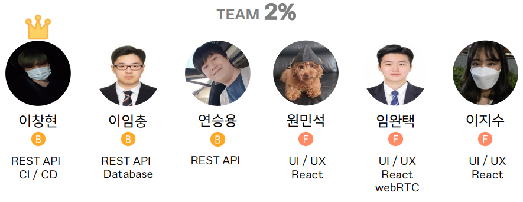

<!-- ABOUT THE PROJECT -->
# 프로젝트 소개
## TT - For TRPG with Online!

<!--사진-->

[TT](https://i7a809.p.ssafy.io/)
온라인에서도 TRPG를 즐길 수 있는 서비스입니다!

아래 홈페이지의 주요 사진들입니다.

첫 화면

       

<h6>홈페이지에 들어갔을 나타나는 첫 화면입니다.</h6>
<h6>회원가입을 진행하신 다음, 로그인을 하면 서비스를 이용할 수 있습니다.</h6>

파티 모집 게시판 - 작성

       

<h6>같이 게임을 즐길 인원을 모집하는 게시판입니다.</h6>
<h6>같이 플레이할 인원 수와 게임할 시간, 그리고 작성자가 어느 포지션으로 게임을 뛸 것인지 고를 수 있습니다.</h6>

파티 모집 게시판 - 플레이어 등록

       

<h6>파티 모집 중인 게시물에 들어가서 참가 신청을 할 수 있습니다.</h6>

파티 모집 게시판 - 방 입장

       

<h6>게시글에 적힌 시간이 되면 참가 신청을 한 사람에 한하여 방에 입장할 수 있는 버튼이 생깁니다.</h6>

플레이어 첫 화면

       

<h6>플레이어가 방에 입장한 후 보이는 첫 화면입니다.</h6>
<h6>직업을 고를 수 있고, info를 통해 해당 직업에 대한 설명도 볼 수 있습니다.</h6>

플레이어 캐릭터 프로필

       

<h6>처음 보이는 캐릭터 프로필 생성을 완료하면 볼 수 있는 프로필 화면입니다.</h6>

GM 첫 화면

       

<h6>GM이 방에 입장한 후 보이는 첫 화면입니다.</h6>
<h6>GM은 플레이어와 다르게 프로필을 생성하지 않습니다. 다만 GM만이 운영할 수 있는 시스템이 있습니다.</h6>

GM 게임 운영 메뉴

       

<h6>GM이 게임을 진행하면서 누를 수 있는 버튼입니다.</h6>
<h6>플레이어의 HP에 변화를 주거나, 아이템을 주고, 스탯을 보상으로 주는 등의 메뉴가 있습니다.</h6>

지도

       

<h6>지도입니다. 여러분이 계신 또 다른 공간을 보여줍니다.</h6>

주사위

       

<h6>주사위입니다. 여러분의 실력에 따라 미래가 바뀔 것입니다.</h6>

(<a href="#readme-top">맨 위로</a>)

## 개발
### 기술 스택
- FRONTEND:       
  [![JAVASCRIPT][JAVASCRIPT-img]][JAVASCRIPT-url] [![TYPESCRIPT][TYPESCRIPT-img]][TYPESCRIPT-url]      
  [![React][React-img]][React-url] ![ReactRouter][ReactRouter-img] ![REDUX][REDUX-img]       
  ![Axios][Axios-img] ![SockJS][SockJS-img] ![StompJS][StompJS-img]    

- **BACKEND**:    
  [![SpringBoot][SpringBoot-img]][SpringBoot-url] [![JPA][JPA-img]][JPA-url] [![JWT][JWT-img]][JWT-url]   
  ![MYSQL][MYSQL-img]

- **CI/CD**

  ​	  

### 사용 IDE
- FRONTEND:     
![VSCODE][VSCODE-img]
- BACKEND:     
![INTELLIJ][INTELLIJ-img], ![MYSQLWorkbench][MYSQLWorkbench-img]
- 추가:   
![MobaXterm][MobaXterm-img]

(<a href="#readme-top">맨 위로</a>)

## 플로우 차트
1. 프론트엔드
* 
* 
2. 백엔드
* 
* 

(<a href="#readme-top">맨 위로</a>)

## 배포 환경

Ubuntu 20.04.4 LTS

Node.js 16.16.0

NGINX 1.18.0 (Ubuntu)

Docker version 20.10.17

JAVA openjdk version 1.8.0_342

### 배포 아키텍쳐

(<a href="#readme-top">맨 위로</a>)

## 팀 멤버

<!-- MARKDOWN LINKS & IMAGES -->
<!-- https://www.markdownguide.org/basic-syntax/#reference-style-links -->
<!--backend-->

[SpringBoot-img]: https://img.shields.io/badge/SpringBoot-6DB33F?style=for-the-badge&logo=SpringBoot&logoColor=white
[SpringBoot-url]: https://spring.io/projects/spring-boot
[JPA-img]: https://img.shields.io/badge/SpringDataJPA-6DB33F?style=for-the-badge&logo=Spring&logoColor=white
[JPA-url]: https://spring.io/projects/spring-data-jpa
[JWT-img]: https://img.shields.io/badge/JSONWebTokens-000000?style=for-the-badge&logo=JSONWebTokens&logoColor=white
[JWT-url]: https://jwt.io/
[MYSQL-img]: https://img.shields.io/badge/MySQL-4479A1?style=for-the-badge&logo=MySQL&logoColor=white
<!--frontend-->
[React-img]: https://img.shields.io/badge/React-61DAFB?style=for-the-badge&logo=React&logoColor=white
[React-url]: https://reactjs.org/
[REDUX-img]: https://img.shields.io/badge/Redux-764ABC?style=for-the-badge&logo=Redux&logoColor=white
[RUDUX-url]: https://redux.js.org/
[TYPESCRIPT-img]: https://img.shields.io/badge/TypeScript-3178C6?style=for-the-badge&logo=TypeScript&logoColor=white
[TYPESCRIPT-url]: https://www.typescriptlang.org/
[JAVASCRIPT-img]: https://img.shields.io/badge/JavaScript-F7DF1E?style=for-the-badge&logo=JavaScript&logoColor=white
[JAVASCRIPT-url]: https://www.javascript.com/
[SockJS-img]: https://img.shields.io/badge/SockJS-010101?style=for-the-badge&logo=SockJS&logoColor=white
[StompJS-img]: https://img.shields.io/badge/StompJS-010101?style=for-the-badge&logo=StompJS&logoColor=white
[Axios-img]: https://img.shields.io/badge/AXIOS-6236FF?style=for-the-badge&logo=AXIOS&logoColor=white
[ReactRouter-img]: https://img.shields.io/badge/ReactRouter-CA4245?style=for-the-badge&logo=ReactRouter&logoColor=white
<!--IDE-->
[VSCODE-img]: https://img.shields.io/badge/VisualStudioCode-007ACC?style=for-the-badge&logo=VisualStudioCode&logoColor=white
[INTELLIJ-img]: https://img.shields.io/badge/IntelliJIDEA-000000?style=for-the-badge&logo=IntelliJIDEA&logoColor=white
[MYSQLWorkbench-img]: https://img.shields.io/badge/MySQLWorkbench-4479A1?style=for-the-badge&logo=MySQL&logoColor=white
[MobaXterm-img]: https://img.shields.io/badge/MobaXterm-000000?style=for-the-badge&logo=MobaXterm&logoColor=white

